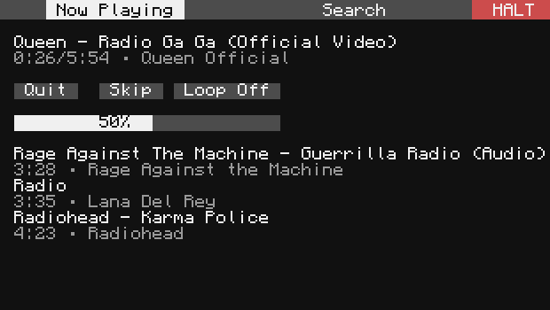

# Redionet

Synchronized, server-wide music streaming with ComputerCraft.

**Features**
- Shared audio streaming anywhere in a server, even across dimensions!
- Scrollable Search Results. Use arrow keys to scroll results
- Keyboard Controls. Search and add songs mouse-free
- Song Announcements. Notifications sent out for each new track
- Chat Commands. Stay up to date and in sync by simply typing in the chat or terminal
- Pocket Features. Search and add songs from anywhere, at any time




## Installation
Option 1: `pastebin`
```sh
pastebin run TH0EPrX0
```

Option 2: `wget` 
```sh
wget run https://raw.githubusercontent.com/Rypo/redionet/refs/heads/main/install.lua
```

## Setup

You'll need exactly 1 Server computer and as many Client computers as you'd like, but at least one to get started. 

Computers are designated as either the Server or a Client upon running the Installation script.

### Minimum
**Server** - Advanced Computer/Turtle with Ender modem

**Client(s)** - Advanced Computer/Turtle with Ender modem + Speaker 

### Preferred
_[Advanced Peripherals](https://docs.advanced-peripherals.de/latest/) (AP) mod required for some peripherals._

**Both Server and Clients** 
- A nearby chunk loader (e.g., [chunky turtle](https://docs.advanced-peripherals.de/latest/turtles/chunky_turtle/))

The **server chunk must be loaded** at all times for clients to function properly.
Client chunks do not all _need_ to be force loaded, however, frequently cycling chunks in/out will likely result in audio stuttering/synchronization issues. 

**Server**
- Advanced Monitors - better presentation of debug/client health info (at least 5w x 3h)
- [Chat Box](https://docs.advanced-peripherals.de/latest/peripherals/chat_box/) - enables chat commands + song announcements (chat message)
- [Player Detector](https://docs.advanced-peripherals.de/latest/peripherals/player_detector/) - enables fancy song announcements (toast notifications)

**Clients**: no additional peripheral recommendations


### Additional (Optional)

**Pocket Client**: Advanced Pocket Computer with Ender modem
- Allows you to add songs on the go!
  
At the moment, Pockets are limited to queue management (i.e., no audio) in the majority of cases. Certain alpha [CC:T+MC versions](https://github.com/cc-tweaked/CC-Tweaked/commit/0a0c80d) allow 2 peripheral attachments on pocket devices. These versions may support Pocket audio clients, but this has not been tested. 

### Settings

`redionet.log_level` - The lowest severity message to display on the Server screen. 
1=DEBUG, 2=INFO, 3=WARN, 4=ERROR (default=3).

Non-user Settings (auto-assigned during installation) - `redionet.device_type` and `redionet.run_on_boot`. Do not manually change these - use the install script instead.

## Chat Commands
- `rn reboot` - Reboots server+clients, will not auto start program unless run on startup selected during installation.
- `rn reload` - Attempts to reload server+clients without shutting down. Less reliable than _rn reboot_ but doesn't require run on start. 
- `rn update` - Pulls the latest code from GitHub and reloads.
- `rn sync`   - Forces clients to resynchronize audio streams.

### Command Usage

**With AP mod** and a Chat Box peripheral attached,
- Simply type the command in chat to use it. You'll see a chat confirmation (unless sent silently, e.g., `$rn sync`) and it will execute.

**Without AP mod**, there are two alternative ways to use commands.
1. If you're next to the server computer, type the command into the server's built-in `CMD>` line.
   
2. Get a wireless pocket computer, open the `lua` repl, and send the command over the `PROTO_CHATBOX` rednet protocol, e.g.
    ```lua
    peripheral.find("modem", rednet.open)
    rednet.broadcast("rn update", "PROTO_CHATBOX")
    ```

## Known Limitations
- Pausing the game can throw off timings and desynchronize the audio. *Use in single player is not recommended*.
- Active clients skip ahead slightly whenever a client joins the session to maintain synchronization.
- Audio may become choppy if no players are in range of a speaker. This will self-correct over time, but you can expedite the process by toggling Quit/Join or using the `rn sync` command. 
- Age-restricted and videos longer than ~20 minutes may fail to download. The exact threshold varies; in testing, the shortest failure was ~18min, the longest success ~45min.

## Acknowledgements
- The [foundational code author](https://github.com/terreng/computercraft-streaming-music) and backend host. This project is rooted in his original work. 
- [YouCube](https://github.com/CC-YouCube/client) - a continual source of design and function inspiration throughout development.